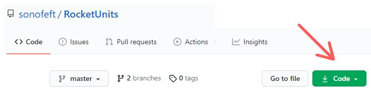
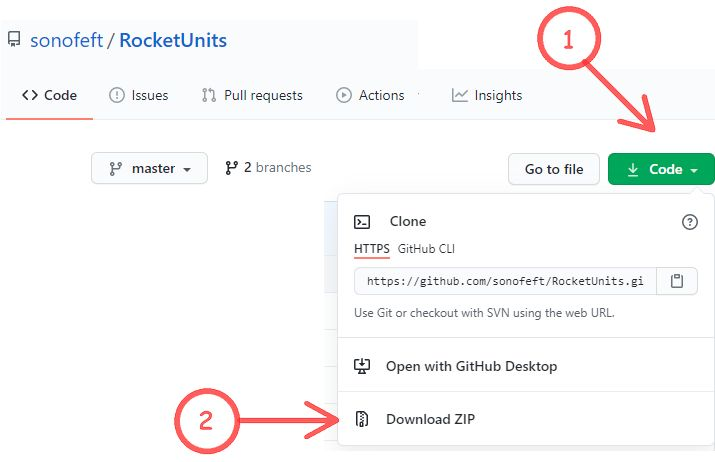
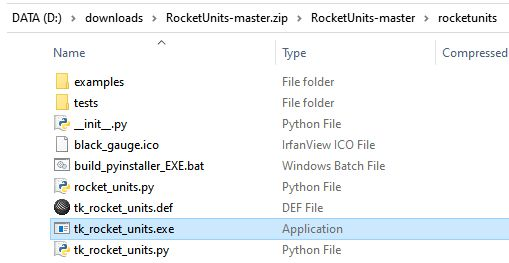
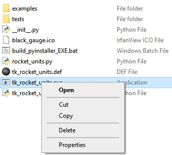
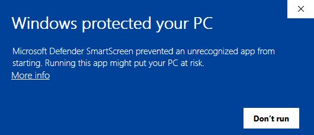
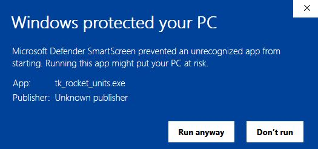

.. downloadexe

.. _internal_exe_download:

Windows EXE Download
====================

If desired, the **RocketUnits** GUI can be run as a stand-alone executable (EXE) file
that **DOES NOT** require python to be installed on the machine.

This is made possible though the use of the 
`pyinstaller <http://www.pyinstaller.org/>`__ project.
(see  `documentation <https://readthedocs.org/projects/pyinstaller/downloads/pdf/stable/>`_).

Browser to Github
-----------------

To download the Windows executable (EXE) file, use a browser such as Chrome, Firefox or Edge
and navigate to `https://github.com/sonofeft/RocketUnits <https://github.com/sonofeft/RocketUnits>`_

The page should look something like the image below with a **Code** button at the upper right.

Download ZIP File
-----------------

After (1) clicking the **Code** button, (2) click **Download ZIP**.

Extract EXE from ZIP
--------------------

The downloaded ZIP file should now be in your download folder on your Windows machine.

It will have a path something like:  

.. code-block:: console

    <Your Path>\RocketUnits-master.zip\RocketUnits-master\rocketunits\tk_rocket_units.exe

Right Click
~~~~~~~~~~~

**Right-Click** on *tk_rocket_units.exe*, and the option to **Copy** the file should be presented.

    
**Copy** the EXE file and **Paste** it somewhere in your file system,
preferably somewhere in your system PATH.

It is now ready to run.

For convenience, you can 
`create a desktop shortcut <https://www.computerhope.com/issues/ch000739.htm>`__ 
to **tk_rocket_units.exe**.

Run the EXE File
----------------

**Double-click** the **tk_rocket_units.exe** file and it will run.  

.. NOTE::

    Note that the **First** time you run the code,
    on Windows 10, you may be presented 
    with a warning screen such as the one below.

More info
~~~~~~~~~

Click the text **More info** in the warning screen and it should change to the following.

    
Click **Run anyway** and the executable will run.

From this point on, it should run without the warning screen appearing.

Safety Concerns
---------------

Typically it is considered unsafe to run EXE files downloaded from the internet.

If there is any concern about running **tk_rocket_units.exe**, it would be easy
to build a safe copy using the `pyinstaller <http://www.pyinstaller.org/>`__ project.
(see  `documentation <https://readthedocs.org/projects/pyinstaller/downloads/pdf/stable/>`_).

There is a Windows batch file "build_pyinstaller_EXE.bat"
(see `Extract EXE from ZIP`_) that shows 
the required pyinstaller command to create
a platform-compliant executable (visit `pyinstaller <http://www.pyinstaller.org/>`__ 
for install instructions).

Unzip the ZIP file downloaded at `Download ZIP File`_
using an application like `7-Zip <https://www.7-zip.org/>`_ or **Extract All**
in Windows File Explorer.

From a Windows command prompt, navigate to that **RocketUnits** directory and give the 
following command.

.. code-block:: console

    pyinstaller --onefile --noconsole --icon=black_gauge.ico tk_rocket_units.py

A new **dist** directory will be created, and within it will reside the new **tk_rocket_units.exe**.
