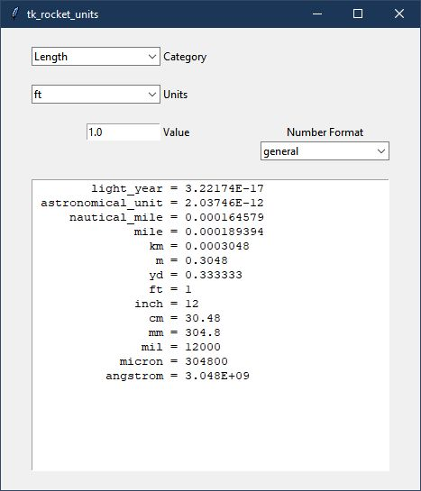

.. quickstart

QuickStart
==========

Install RocketUnits
-------------------

The easiest way to install **RocketUnits** is

.. code-block:: console

    pip install rocketunits
    
        OR on Linux
    sudo pip install rocketunits
        OR perhaps
    pip install --user rocketunits

In case of error, see `pip Error Messages`_

Installation From Source
------------------------

Much less common, but if installing from source, then
the best way to install rocketunits is still ``pip``.

After navigating to the directory holding **RocketUnits** source code, do the following

.. code-block:: console

    cd full/path/to/rocketunits
    pip install -e .
    
        OR on Linux
    sudo pip install -e .
        OR perhaps
    pip install --user -e .
    
This will execute the local ``setup.py`` file and insure that the pip-specific commands in ``setup.py`` are run.

Running RocketUnits
-------------------

After installing with ``pip``, there will be a launch command line program called 
**rocketunits** or, on Windows, **rocketunits.exe**. 

From a terminal or command prompt window simply type

.. code-block:: console

    rocketunits

and **RocketUnits** GUI (tk_rocket_units) will start. 

    

If it does not start, then there may be an issue with your system path.
The path for the rocketunits executable might be something like

.. code-block:: console

    /usr/local/bin/rocketunits             (if installed with sudo pip install -e .)
         or 
    /home/<user>/.local/bin/rocketunits    (if installed with pip install -e .)
         or 
    C:\Python37\Scripts\rocketunits.exe    (on Windows)

Make sure your system path includes the above path to **rocketunits**.

Stand-Alone EXE 
---------------

If desired, the **RocketUnits** GUI can be run as a stand-alone executable (EXE) file
that **DOES NOT** require python to be installed on the machine.

This is made possible though the use of the 
`pyinstaller <http://www.pyinstaller.org/>`__ project.
(see  `documentation <https://readthedocs.org/projects/pyinstaller/downloads/pdf/stable/>`_).

For convenience, a Windows EXE file on the 
`RocketUnits Github page <https://github.com/sonofeft/RocketUnits>`_ can be
downloaded (created with python 3.7 64 bit version).

Place the executable anywhere in your system PATH or create a desktop shortcut.

There is also a Windows batch file "build_pyinstaller_EXE.bat" that shows 
the required pyinstaller command to create
a platform-compliant executable if `pyinstaller <http://www.pyinstaller.org/>`__ 
is installed.

From a console, navigate to the **RocketUnits** install directory and give the 
following command.

.. code-block:: console

    pyinstaller --onefile --noconsole --icon=black_gauge.ico tk_rocket_units.py

To find the install directory, an interactive python session like the 
following will display the location.

.. code-block:: console

    C:\>python
    Python 3.7.4 (tags/v3.7.4:e09359112e, Jul  8 2019, 20:34:20) [MSC v.1916 64 bit (AMD64)] on win32
    Type "help", "copyright", "credits" or "license" for more information.
    >>> from rocketunits import rocket_units
    >>> rocket_units.__file__
    'D:\\python37_64\\Lib\\site-packages\\rocketunits\\rocket_units.py'
    >>>

For the above result, navigating to that location would then be the following command.
(your command would differ)

.. code-block:: console

    cd D:\\python37_64\\Lib\\site-packages\\rocketunits

pip Error Messages
------------------

If you get an error message that ``pip`` is not found, see 
`<https://pip.pypa.io/en/latest/installing.html>`_ for full description of ``pip`` installation.

If you give up on installing with ``pip``, 
you might also try downloading the rocketunits source package 
(and all dependency source packages)
from PyPI and installing from source as shown above at 
`Installation From Source`_

